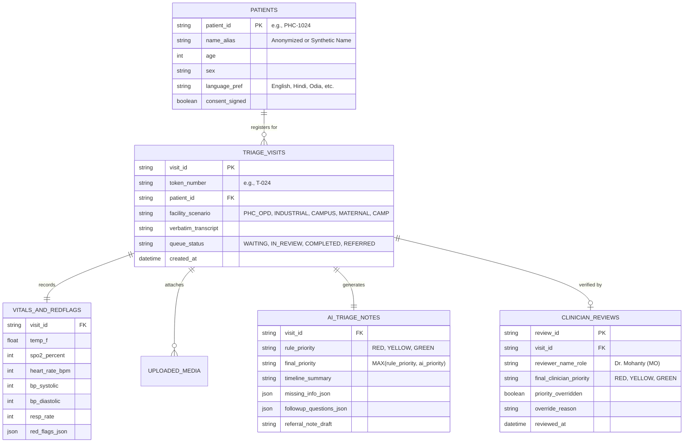

# System & AI Architecture Document: Saransh (सारांश)

**Project:** Saransh (सारांश)  
**Architecture Paradigm:** Hybrid Deterministic Safety-Rule Engine + Single-Call Multimodal Structured LLM (`gemini-2.5-flash`) + Offline-First React PWA + FastAPI Backend

---

## 1. Recommended AI & Full-Stack Technology Selection

To build a **standardized, rock-solid, live-demoable application** for your hackathon without brittle dependencies or complex multi-model orchestration fail points, use the following stack:

### 1.1 Why This Specific AI Architecture Wins Hackathons
Instead of stitching together 5 separate fragile libraries (separate Whisper server + separate Tesseract OCR binary + separate IndicTrans2 model + separate LLM), use **Google's official `@google/genai` (or Python `google-genai` SDK) with `gemini-2.5-flash`** alongside a **Deterministic Python Safety Rule Engine**:

| Layer | Recommended Technology | Why It Is Best for Saransh (सारांश) |
| :--- | :--- | :--- |
| **Primary Multimodal AI** | **`gemini-2.5-flash`** (via official `google-genai` Python SDK) | **Native Multimodal in 1 API Call:** Accepts **Audio bytes** (Odia/Hindi/English voice), **Lab Report / Prescription Images** (OCR), **Visual Symptom Photos** (rash/swelling), and **Text/Vitals** simultaneously, returning a strictly validated **Pydantic Structured JSON Schema** in ~2–3 seconds. |
| **Safety-Critical Triage Logic** | **Deterministic Python Rule Engine (`triage_rules.py`)** + Client-Side JS Mirror | **100% Explainable & Offline-Capable:** Evaluates $\text{SpO}_2$, BP, HR, Temp, RR, and Red Flags using hard clinical rules. Satisfies the **20% Safety-First Workflow** rubric criterion and guarantees zero LLM hallucination on life-threatening vitals. |
| **Instant Voice Input (Frontend)** | **Browser Web Speech API (`hi-IN`, `or-IN`, `en-IN`) + `MediaRecorder` Audio Upload to Gemini** | Dual-layer reliability: Web Speech API gives instant live typing captions during the demo, while sending the recorded audio blob to `gemini-2.5-flash` accurately translates complex Odia/Hindi colloquial speech (`"Mote bahut chest pain heuchhi..."`). |
| **Frontend Application** | **React 18 + Vite + Tailwind CSS + Lucide Icons** | Fast HMR, crisp medical-grade UI, built-in `LocalStorage / IndexedDB` offline queue buffer, and zero-config deployment. |
| **Backend API** | **Python 3.11+ with FastAPI + Pydantic v2** | Native async endpoints, automatic OpenAPI (`/docs`) Swagger UI for judges to inspect, and seamless integration with `google-genai` structured outputs. |
| **Database & Real-Time Queue** | **SQLite (`SQLAlchemy`) or Firebase Firestore + LocalStorage Offline Sync** | SQLite + FastAPI runs 100% locally on your laptop during the hackathon presentation with zero cloud firewall issues, pre-seeded with realistic synthetic PHC patients. |

---

## 2. High-Level System Architecture Diagram

```mermaid
flowchart TB
    subgraph Client_Layer ["Frontend PWA (React + Vite + Tailwind CSS)"]
        UI_Intake["Nurse Intake Station\n(Voice, Text, Vitals, Photo/Report)"]
        UI_Rules_JS["Client-Side Mirror Rule Engine\n(Instant Offline RED/YELLOW/GREEN)"]
        Offline_DB[("IndexedDB / LocalStorage\nOffline Queue Buffer")]
        UI_Dash["Doctor / Reviewer Dashboard\n(Live Queue, Override, Referral PDF)"]
    end

    subgraph Backend_Layer ["FastAPI Backend Server (Python 3.11)"]
        API_Gateway["FastAPI REST Endpoints\n(/api/triage/analyze, /api/queue, /api/review)"]
        PII_Guard["Privacy & PII Scrubber\n(Consent Check + Masking)"]
        Rule_Engine["Deterministic Clinical Rule Engine\n(Vital Thresholds + Red Flags)"]
        Prompt_Builder["Multimodal Prompt & Schema Orchestrator"]
        Audit_Logger["Human-in-the-Loop Audit & Feedback Store"]
    end

    subgraph AI_Layer ["Google Gemini API (google-genai SDK)"]
        Gemini_Flash["gemini-2.5-flash\n• Odia/Hindi/English Audio Understanding\n• Medical Report OCR (CBC, ECG, Rx)\n• Non-Diagnostic Visual Observation\n• Timeline & Missing Info JSON Output"]
    end

    subgraph Storage_Layer ["Persistent Database (SQLite / Firestore)"]
        DB_Patients[("patients & tokens")]
        DB_Triage[("triage_notes & vitals")]
        DB_Reviews[("clinician_reviews & overrides")]
    end

    UI_Intake -->|Online POST Multipart/JSON| API_Gateway
    UI_Intake -.->|If Offline| UI_Rules_JS
    UI_Rules_JS -.-> Offline_DB
    Offline_DB -.->|Auto-Sync on Reconnect| API_Gateway

    API_Gateway --> PII_Guard
    PII_Guard --> Rule_Engine
    PII_Guard --> Prompt_Builder
    Prompt_Builder -->|Audio + Report Image + Vitals + Context| Gemini_Flash
    Gemini_Flash -->|Strict Pydantic JSON Schema| API_Gateway
    Rule_Engine -->|Hard Priority Floor (Max Urgency)| API_Gateway

    API_Gateway --> DB_Patients & DB_Triage
    DB_Triage --> UI_Dash
    UI_Dash -->|POST Clinician Override / Sign-off| Audit_Logger
    Audit_Logger --> DB_Reviews
```

---

## 3. Hybrid AI Triage Engine Pipeline (Code-Level Design)

### 3.1 Step 1: Deterministic Safety Check (`backend/triage_rules.py`)
Before or in parallel with calling Gemini, the deterministic function computes the **Safety Floor**:

```python
from typing import List, Tuple
from models import VitalsInput, RedFlagsInput

def evaluate_deterministic_triage(vitals: VitalsInput, red_flags: RedFlagsInput, age: int) -> Tuple[str, List[str], str]:
    reasons = []
    priority = "GREEN"
    department = "General Medicine OPD"

    # 1. Check Critical Vital Sign Thresholds -> RED
    if vitals.spo2_percent is not None and vitals.spo2_percent < 90:
        priority = "RED"
        reasons.append(f"Critical Hypoxia: SpO₂ is {vitals.spo2_percent}% (< 90% emergency threshold)")
        department = "Emergency / Acute Respiratory Care"

    if vitals.bp_systolic is not None and (vitals.bp_systolic >= 180 or vitals.bp_systolic < 85):
        priority = "RED"
        reasons.append(f"Critical Blood Pressure: Systolic BP {vitals.bp_systolic} mmHg")
        department = "Emergency Bay"

    if vitals.heart_rate_bpm is not None and (vitals.heart_rate_bpm > 130 or vitals.heart_rate_bpm < 45):
        priority = "RED"
        reasons.append(f"Critical Heart Rate: {vitals.heart_rate_bpm} bpm")

    # 2. Check Explicit Clinical Red Flags -> RED
    if red_flags.severe_chest_pain:
        priority = "RED"
        reasons.append("Red Flag: Severe Chest Pain reported")
        department = "Emergency / Cardiac Assessment Bay"
    if red_flags.severe_breathing_difficulty:
        priority = "RED"
        reasons.append("Red Flag: Severe Difficulty Breathing reported")
        department = "Emergency / Acute Respiratory Care"
    if red_flags.loss_of_consciousness or red_flags.seizure or red_flags.sudden_weakness_paralysis:
        priority = "RED"
        reasons.append("Red Flag: Acute Neurological / Consciousness Emergency")
        department = "Emergency / Trauma & Neuro Bay"

    # 3. Check Urgent Thresholds -> YELLOW (only if not already RED)
    if priority != "RED":
        if vitals.spo2_percent is not None and 90 <= vitals.spo2_percent <= 93:
            priority = "YELLOW"
            reasons.append(f"Borderline Oxygen Saturation: SpO₂ {vitals.spo2_percent}% (90-93%)")
        if vitals.temperature_f is not None and vitals.temperature_f >= 101.5:
            priority = "YELLOW"
            reasons.append(f"High Grade Fever: Temperature {vitals.temperature_f}°F")
        if vitals.heart_rate_bpm is not None and 105 <= vitals.heart_rate_bpm <= 130:
            priority = "YELLOW"
            reasons.append(f"Elevated Heart Rate (Tachycardia): {vitals.heart_rate_bpm} bpm")
        if age >= 65 or age <= 5:
            if reasons:
                reasons.append(f"High-risk age group ({age} yrs) with abnormal clinical parameters")

    if not reasons:
        reasons.append("Vitals within stable baseline ranges; no immediate red flags reported.")

    return priority, reasons, department
```

### 3.2 Step 2: Gemini 2.5 Flash Multimodal Structured Output (`backend/ai_service.py`)
Using the official `google-genai` SDK (`from google import genai`), we pass the patient's voice/text, vitals, facility scenario, and any uploaded report/symptom image, enforcing a strict `response_schema`:

```python
from google import genai
from google.genai import types
from pydantic import BaseModel, Field
from typing import List

class AITriageSynthesis(BaseModel):
    translated_patient_statement: str = Field(description="English translation of patient's vernacular statement")
    chief_complaint_standardized: str = Field(description="Concise standardized clinical chief complaint")
    chronological_timeline: str = Field(description="Step-by-step timeline of symptom progression and history")
    extracted_report_findings: List[str] = Field(description="Key values extracted via OCR from uploaded lab reports/prescriptions")
    visual_input_observation: str = Field(description="Non-diagnostic descriptive observation of uploaded photo if present")
    missing_information_gaps: List[str] = Field(description="Important clinical questions/data still missing from intake")
    followup_questions_english: List[str] = Field(description="3 high-yield follow-up questions for the health worker to ask")
    followup_questions_local_language: List[str] = Field(description="Same 3 follow-up questions translated into patient's preferred language (e.g., Odia/Hindi)")
    advisory_priority: str = Field(description="Suggested priority: RED, YELLOW, or GREEN")
    explainable_reasoning: List[str] = Field(description="Bullet points explaining why this urgency level is advised")
    suggested_department: str = Field(description="Suggested hospital department or clinic unit")
    concise_clinician_summary: str = Field(description="3-sentence structured handover summary for the reviewing doctor")
    referral_note_draft: str = Field(description="Standardized referral note if patient needs escalation to higher center")

def generate_multimodal_triage_note(payload: dict, media_parts: list) -> AITriageSynthesis:
    client = genai.Client()
    system_instruction = (
        "You are Saransh (सारांश), a non-diagnostic clinical triage assistant for Indian government hospitals and PHCs. "
        "CRITICAL SAFETY RULE: Never diagnose a disease or prescribe medicine. Always frame outputs as advisory triage signals "
        "and structured summaries for a qualified healthcare professional. Translate Odia, Hindi, or regional statements accurately."
    )
    response = client.models.generate_content(
        model="gemini-2.5-flash",
        contents=[*media_parts, f"Patient Intake Data: {payload}"],
        config=types.GenerateContentConfig(
            system_instruction=system_instruction,
            response_mime_type="application/json",
            response_schema=AITriageSynthesis,
            temperature=0.1,
        ),
    )
    return AITriageSynthesis.model_validate_json(response.text)
```

---

## 4. Database Schema (Relational / Document Structure)



---

## 5. REST API Endpoints Specification

| Method | Endpoint | Description | Request Body / Params | Response |
| :---: | :--- | :--- | :--- | :--- |
| `POST` | `/api/v1/triage/analyze` | Performs hybrid deterministic + Gemini 2.5 Flash multimodal triage on intake data & optional files | `multipart/form-data` (`intake_json`, `audio_file?`, `report_image?`, `visual_image?`) | `200 OK` (`TriageRecord` with Token, Priority, Questions, Summary) |
| `GET` | `/api/v1/queue` | Returns live prioritized hospital queue (`RED` → `YELLOW` → `GREEN`) + facility resource stats | `?facility_type=PHC_OPD&status=WAITING` | `200 OK` (`QueueDashboardResponse`) |
| `POST` | `/api/v1/triage/{visit_id}/followup` | Appends patient answers to AI-generated follow-up questions and refreshes summary | `{"answers": [{"question": "...", "answer": "..."}]}` | `200 OK` (Updated `TriageRecord`) |
| `POST` | `/api/v1/triage/{visit_id}/review` | Human-in-the-loop sign-off or priority override by Nurse/Doctor | `ClinicianReviewPayload` (`final_priority`, `notes`, `reviewer_id`) | `200 OK` (Audit log receipt + Referral slip) |
| `POST` | `/api/v1/demo/seed` | Resets & seeds the 3 canonical synthetic National Healthcare Hackathon demo patients (`RED`, `YELLOW`, `GREEN`) | `{}` | `200 OK` (`3 patients seeded`) |


