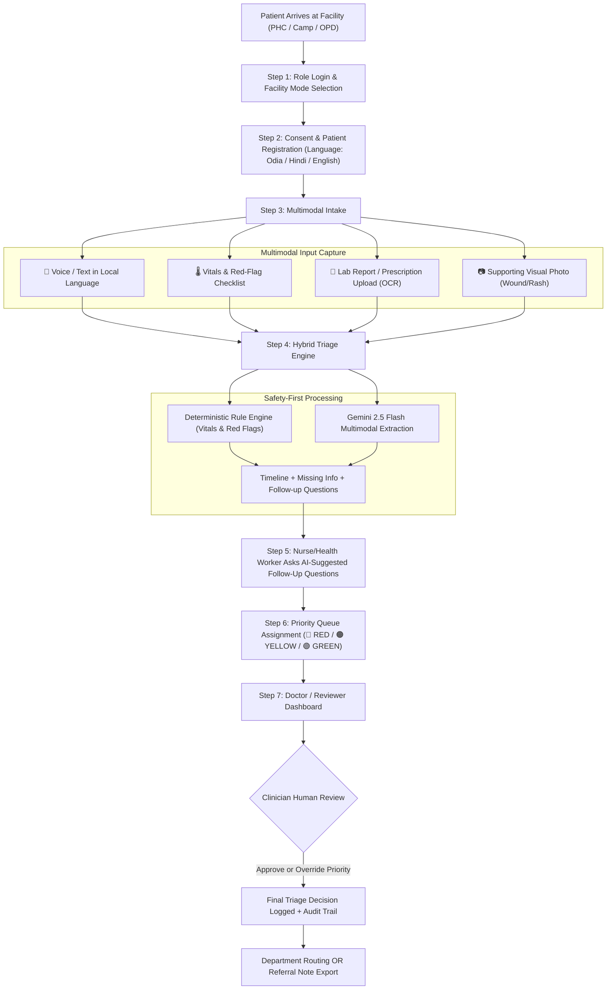

# Product Requirements Document (PRD): Saransh (सारांश)

**Project Title:** Saransh (सारांश) — Multimodal Human-in-the-Loop Healthcare Triage Assistant for Government & Institutional Health Facilities  
**Document Version:** 1.0 (National Health Facilities Edition)  
**Target Environment:** PHCs, CHCs, Government District Hospitals, Public Health Camps, Industrial-Estate Health Units, and Campus Health Centers across India.

---

## 1. Executive Summary & Vision

**One-Line Pitch:**  
> *"An AI-powered multimodal, multilingual, human-in-the-loop triage assistant that helps government and institutional health facilities structure patient intake, detect clinical red flags, and prioritize outpatient queues faster and more safely—without replacing clinical judgment."*

### 1.1 Problem Statement
Government hospitals, Primary Health Centers (PHCs), Community Health Centers (CHCs), industrial clinics, and campus infirmaries across India face acute operational bottlenecks during peak outpatient hours:
1. **Unstructured & Overwhelming Patient Queues:** 150–400+ patients arrive within a narrow morning window with limited nurses and medical officers.
2. **Delayed Red-Flag Detection:** Critical patients (e.g., silent hypoxia with $\text{SpO}_2 < 90\%$, atypical chest pain, maternal emergencies) wait in the same first-come-first-served queue as routine cases.
3. **Linguistic & Literacy Barriers:** Patients express symptoms vernacularly (Odia, Hindi, Bengali, Telugu, Tamil, etc.) with mixed timelines, making rapid structured documentation difficult.
4. **Paper Report Overload:** Patients carry crumpled lab reports, discharge summaries, and prescriptions that take minutes per patient to manually inspect.
5. **Lack of Standardized Referral Notes:** When a PHC or camp refers an urgent case to a District Hospital or Medical College, handoff notes are often incomplete.

### 1.2 Core Non-Diagnostic Mandate
> [!IMPORTANT]
> **Advisory & Non-Diagnostic Boundary:** Saransh (सारांश) **never diagnoses diseases** and **never prescribes medication or treatment**. It acts strictly as an information extractor, timeline organizer, deterministic risk-flag evaluator, and structured triage-note generator for a qualified healthcare professional (ASHA/ANM worker, Staff Nurse, or Medical Officer).

---

## 2. Alignment with Hackathon Evaluation Rubric (100% Weightage Map)

| Evaluation Criterion | Weight | Product Feature / Design Mapping in Saransh (सारांश) |
| :--- | :---: | :--- |
| **1. Safety-First Triage Workflow** | **20%** | Hybrid Deterministic Rule-Engine + LLM Architecture. Hard vital-sign and red-flag rules (`SpO2 < 92%`, chest pain, seizure, altered sensorium) unconditionally trigger `RED (Emergency)` regardless of LLM output. Prominent non-diagnostic banners and mandatory human sign-off. |
| **2. Quality of Information Extraction & Summarization** | **20%** | Structured SOAP/Triage JSON extraction: Chief Complaint, Chronological Symptom Timeline, **Missing Information Detector**, and **Suggested Follow-up Questions** for the nurse/doctor, plus Referral Note generation. |
| **3. Multimodal Capability (Text, Voice, OCR, Image)** | **15%** | Single-pass Gemini 2.5 Flash multimodal ingestion: Multilingual Voice/Audio (`Odia/Hindi/English`), Lab Report/Prescription OCR (`CBC, ECG, Discharge Summary`), and Supporting Visual Input tagging (`skin rash, wound, swelling, eye redness`). |
| **4. India-Wide Facility Relevance & Accessibility** | **15%** | 6 Facility Scenario Presets (OPD Queue, Industrial Estate Clinic, Campus Fever Triage, Maternal Follow-up, Chronic Check-in, Public Health Camp), 12+ Indian languages with original + translated transcript storage, and Offline/Low-Bandwidth PWA queue cache. |
| **5. Human-Review Design & Escalation Logic** | **15%** | Side-by-side AI Triage Note vs. Clinician Verification Panel, 1-click Priority Override (`RED`/`YELLOW`/`GREEN`) with mandatory reason logging, Escalation Alert Banner, and Department/Referral Routing. |
| **6. Privacy & Responsible AI Controls** | **10%** | Explicit Patient Consent Gate, Synthetic Data Demo Mode toggle, PII masking/anonymization for AI calls, Role-Based Access Control (`Nurse Intake` vs. `Doctor Reviewer`), and immutable Audit Trail. |
| **7. Demo Quality** | **5%** | Pre-loaded 1-Click Synthetic Patient Scenarios (`Ramesh - Hypoxia/Cardiac RED`, `Priya - High Fever + CBC Report YELLOW`, `Subhash - Mild Headache GREEN`) + Live Queue Re-sorting Animation. |

---

## 3. Target User Personas & Facility Scenarios

### 3.1 Primary Personas
1. **Frontline Intake Worker / Staff Nurse (ANM / GNM / Camp Coordinator):**
   - **Goal:** Register a patient and complete multimodal triage intake in **under 90 seconds**.
   - **Pain Point:** Typing English clinical notes while listening to a distressed patient speaking Odia or Hindi and checking paper reports.
   - **How the App Helps:** Voice recording in local language + photo capture of lab report + quick vital-sign keypad + AI-generated follow-up questions to ask the patient on the spot.
2. **Reviewing Medical Officer / Doctor (PHC/CHC Doctor, Campus/Industrial Physician):**
   - **Goal:** Scan the waiting queue sorted by clinical urgency, review a structured 10-second summary before calling the patient, and approve/override the triage decision or generate a referral letter.
   - **Pain Point:** Reading long unstructured notes or missing a deteriorating patient at token #65.
3. **Patient / Attendant:**
   - **Goal:** Explain symptoms in their native language without struggling with medical jargon, and receive a prioritized token (`T-024 [RED]`) with clear department direction.

### 3.2 Supported India-Wide Facility Modes
The application includes a **Facility Context Switcher** in the header that adapts red-flag rules and follow-up question templates to six institutional contexts:
1. **PHC / District Hospital OPD Queue Triage** *(Default)*
2. **Occupational-Health Screening (Industrial Estates)** *(Focus: chemical/heat exposure, trauma, respiratory PPE history)*
3. **Campus Health Center Fever Triage** *(Focus: vector-borne cluster signs, hostel duration, hydration/platelet check)*
4. **Maternal-Health Follow-Up Clinic** *(Focus: gestational age, BP/pre-eclampsia signs, pedal edema, fetal movement)*
5. **Chronic Disease Check-In (NCD Clinic)** *(Focus: hypertension/diabetes medication adherence, fasting blood glucose, foot/vision checks)*
6. **Public Health Camp Screening** *(Focus: rapid offline batch registration, referral slip generation for tertiary hospital)*

---

## 4. Detailed Functional Scope & Feature Matrix

### 4.1 P0 Features (Must-Have for Hackathon MVP Live Demo)
* **F1. Consent-First Patient Registration & Token Generator:** Capture Patient ID (or ABHA Mock ID), Name/Anonymized Alias, Age, Sex, Facility Mode, Language Preference (`English`, `Hindi`, `Odia`, + regional options), and Informed Consent checkbox. Auto-assign Token (`e.g., T-038`).
* **F2. Multilingual Voice & Text Symptom Intake:** Record voice or type in Odia/Hindi/English. Store **both** the verbatim original patient statement (`"Mote bahut chest pain heuchhi au saans nebaku kasta heuchhi"`) and the standardized English clinical translation.
* **F3. Vital Signs & Red-Flag Checklist Input:** Structured inputs with unit labels and real-time threshold highlighting for Temperature (°F/°C), $\text{SpO}_2$ (%), Pulse/HR (bpm), Blood Pressure (mmHg), Respiratory Rate (/min), and Blood Glucose (mg/dL), plus 8 emergency red-flag checkboxes.
* **F4. Multimodal Medical Report OCR & Visual Signal Intake:** Upload sample Blood Test (CBC/LFT), ECG/X-ray report text, or Prescription image, plus optional non-diagnostic visual photo (rash, wound, swelling). Extract key abnormal values with source attribution.
* **F5. Hybrid AI Triage Engine (Deterministic Rules + Gemini Structured Extraction):**
  - Deterministic Python rule-engine calculates baseline urgency (`RED` / `YELLOW` / `GREEN`) and explicit trigger reasons.
  - Gemini 2.5 Flash synthesizes the **Chronological Timeline**, **Missing Information Gaps**, **3 Suggested Follow-Up Questions for the Health Worker**, **Department Routing Suggestion**, and **Advisory Triage Summary**.
* **F6. Real-Time Priority Queue & Resource Dashboard:** Live-sorted board (`🔴 RED Emergency` → `🟠 YELLOW Urgent` → `🟢 GREEN Routine`) alongside hospital resource counters (`Emergency Beds`, `General Beds`, `Doctors On Duty`, `Nurses Available`).
* **F7. Human-in-the-Loop Clinical Review, Override & Referral Slip Generator:** Doctor clicks any patient token to inspect the structured note, answer/check missing info, approve or override the AI priority category with feedback notes, and 1-click export a **Standardized Referral Note** for higher facilities.
* **F8. Offline Queue Buffer & Sync Indicator:** Local IndexedDB/LocalStorage persistence so intake works during internet drops and syncs when online.

---

## 5. User Journey Flow

---

## 6. Out-of-Scope Guardrails (Explicit Boundaries)
1. **No Autonomous Clinical Diagnosis:** The app will never output statements like *"Patient has Acute Myocardial Infarction (87% confidence)"*. Instead, it outputs: *"🔴 HIGH PRIORITY (RED): Reported chest pain with radiation, dyspnea, and SpO₂ 89%. Immediate Medical Officer evaluation in Emergency Bay recommended."*
2. **No Automated Prescription or Drug Dosing:** The app will never recommend antibiotics, analgesics, or dosages.
3. **No Real Patient PII in Hackathon Demo:** All default demo cases use clearly marked synthetic patient profiles (`SYNTH-PHC-1024`, etc.).

