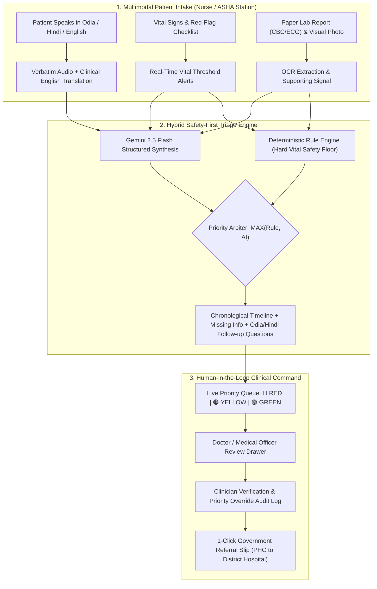

# Saransh (सारांश)
### Multimodal Human-in-the-Loop Healthcare Triage Assistant for Government and Institutional Health Facilities

> **"Right Priority. Right Facility. Right on Time."**  
> An explainable, non-diagnostic clinical triage assistant that combines **Vernacular Voice**, **Lab Report OCR**, **Visual Symptom Signals**, and **Deterministic Vital Checks** to structure chaotic hospital queues into prioritized clinical lanes—while keeping final decisions strictly in the hands of qualified healthcare professionals.

---

## 🏛️ Context & Problem Statement
In Indian Primary Health Centers (PHCs), Community Health Centers (CHCs), District Outpatient Departments (OPD), industrial health units, and public health camps, over 200–400 patients arrive within narrow morning hours. 

### Critical Bottlenecks:
1. **Queue Chaos:** Critical patients (e.g. silent hypoxia with $\text{SpO}_2 < 90\%$, acute atypical chest pain, or maternal pre-eclampsia) wait in the same first-come-first-served queue as mild headaches.
2. **Linguistic Barriers:** Patients describe symptoms in regional colloquialisms (**Odia, Hindi, Bengali, Telugu, Marathi**, etc.) that are hard for rotating staff to transcribe quickly into standardized medical English.
3. **Paper Report Overload:** Crumpled paper lab reports (CBC, ECGs, prescriptions) take minutes to read manually.
4. **Lack of Standardized Referral Notes:** When rural PHCs transfer emergencies to tertiary medical colleges, handoff notes are frequently incomplete or lost.

---

## 💡 The Saransh Solution: Hybrid Triage Architecture



> [!IMPORTANT]
> **Advisory & Non-Diagnostic Guarantee:** Saransh **never diagnoses diseases** and **never prescribes medication**. It acts strictly as an information extractor, timeline organizer, and deterministic urgency flagger for qualified medical staff.

---

## 🏆 Key Features & Innovations

1. **Multimodal Ingestion in a Single Call:**
   * **Voice Audio:** Ingests colloquial speech in Odia, Hindi, and English with live animated waveforms.
   * **OCR Document Extraction:** Extracts quantitative parameters from CBC, ECG, and prescriptions.
   * **Visual Signals:** Documents non-diagnostic photos of rashes, wounds, and pedal edema.
   * **Structured Vitals:** Live color-coded threshold alerts for $\text{SpO}_2$, BP, Heart Rate, and Temperature.
2. **Deterministic Safety-First Priority Engine:**
   * Hard clinical rules ($\text{SpO}_2 < 90\% \rightarrow \text{RED}$, Systolic BP $\ge 180 \rightarrow \text{RED}$, severe chest pain $\rightarrow \text{RED}$) act as an un-downgradable safety floor (`MAX(Rule, AI)`). The LLM cannot hallucinate an emergency away.
3. **Interactive 2D Anatomical Body Map:**
   * Clickable anatomical selector (Head, Chest, Abdomen, Limbs, Skin) enabling non-literate patients in rural camps to point to symptoms visually.
4. **Holographic ABDM / ABHA Digital Health Card:**
   * Integrated Ayushman Bharat Digital Mission (ABDM) mock card pulling verified demographics, chronic conditions, and critical drug allergy alerts in 1 click.
5. **Human-in-the-Loop Review & Priority Override:**
   * Reviewing doctors can inspect the chronological timeline, review missing information gaps, override priority tiers with mandatory clinical justification, and trace all changes in an immutable audit trail.
6. **Standardized Government Referral Slip:**
   * 1-click printable transfer slip with National Health Mission formatting, emergency contacts, vital progression, oxygen notes, and hospital transfer barcode.
7. **Offline-First PWA Resilience:**
   * When rural PHC connectivity drops, local browser-based deterministic triage and `LocalStorage` caching keep queue registration running with auto-sync when online.

---

## 📊 Priority Classification Matrix

| Level | Urgency | Vital Sign Thresholds | Red-Flag Criteria | Queue SLA |
| :---: | :---: | :--- | :--- | :---: |
| 🔴 **RED** | **Emergency (P1)** | • $\text{SpO}_2 < 90\%$<br>• $\text{Systolic BP} \ge 180$ or $< 85\text{ mmHg}$<br>• $\text{HR} > 130$ or $< 45\text{ bpm}$<br>• $\text{Temp} > 104^\circ\text{F}$ | • Severe retrosternal chest pain<br>• Severe dyspnea / stridor<br>• Loss of consciousness / syncope<br>• Active uncontrolled bleeding<br>• Seizure or sudden paralysis | **Immediate (0 min wait)**<br>Emergency Bay Alert |
| 🟠 **YELLOW** | **Urgent (P2)** | • $\text{SpO}_2\ 90\% - 93\%$<br>• $\text{HR}\ 105 - 130\text{ bpm}$<br>• $\text{Systolic BP}\ 140 - 179\text{ mmHg}$<br>• $\text{Temp}\ 101.5^\circ\text{F} - 104^\circ\text{F}$ | • High fever $\ge 3$ days<br>• Severe headache with vomiting<br>• Abnormal lab report flag (e.g. Platelets $< 100\text{k}$)<br>• Maternal pregnancy risk signs | **Target < 15–20 min**<br>Priority Fast-Track OPD |
| 🟢 **GREEN** | **Routine (P3)** | • $\text{SpO}_2 \ge 94\%$<br>• $\text{HR}\ 60 - 100\text{ bpm}$<br>• $\text{BP}\ 90/60 - 139/89\text{ mmHg}$<br>• $\text{Temp} < 101.5^\circ\text{F}$ | • Mild cold / cough / sore throat<br>• Routine medication refill<br>• Mild chronic musculoskeletal ache | **Standard OPD Queue**<br>General Care Desk |

---

## 🛠️ Technology Stack

| Layer | Technologies |
| :--- | :--- |
| **Frontend** | React 18, Vite, Tailwind CSS, Lucide Icons, Web Speech API, LocalStorage PWA Sync |
| **Backend** | Python 3.11+, FastAPI, Pydantic v2, Uvicorn, Python-Multipart |
| **AI Engine** | Google Gemini 2.5 Flash (`google-genai` SDK) + Deterministic Clinical Safety Rules |
| **Standards** | ABDM / ABHA Health Record Mock, National Health Mission Referral Schema |

---

## 🚀 Quickstart Guide

### 1. Backend Setup
```bash
cd backend
python -m venv venv
# Windows:
.\venv\Scripts\activate
# Linux/macOS:
source venv/bin/activate

pip install -r requirements.txt
cp .env.example .env
# Add your GEMINI_API_KEY in .env (or run in built-in offline deterministic mode)
uvicorn main:app --reload --port 8000
```
Backend will be live at: `http://localhost:8000`  
Interactive Swagger API Docs: `http://localhost:8000/docs`

### 2. Frontend Setup
```bash
cd frontend
npm install
npm run dev
```
Frontend will be live at: `http://localhost:5173`

---

## 🏥 Supported Facility Modes
1. **PHC & District Hospital OPD Queue Triage** (Default)
2. **Occupational-Health Screening in Industrial Estates** (Focus: chemical vapor, heat, trauma)
3. **Campus Health Center Fever Triage** (Focus: vector-borne clusters, hydration)
4. **Maternal-Health Follow-Up Clinic** (Focus: pre-eclampsia, edema, gestational checks)
5. **Chronic Disease Check-In (NCD Clinic)** (Focus: hypertension, diabetes compliance)
6. **Public Health Camp Screening** (Focus: rapid offline batch intake, tertiary referrals)

---

## 🛡️ Responsible AI & Ethical Safeguards
* **Explicit Informed Consent Gate:** Patient or attendant must grant consent (with emergency unconscious bypass option).
* **Data Minimization & PII Scrubbing:** Patient names are masked to aliases before passing to cloud LLM calls.
* **Deterministic Priority Floor:** The AI model cannot downgrade a patient whose vitals meet emergency criteria.
* **Immutable Reviewer Audit Trail:** Every priority modification, doctor review ID, and clinical override justification is timestamped and recorded.
* **Advisory Disclaimer:** Persistent safety banners ensure the app is never mistaken for autonomous diagnostic software.

---

## 👥 Contributors & Acknowledgments
Built with ❤️ for India's Frontline Healthcare Workers, ASHA/ANM Nurses, and Medical Officers.
